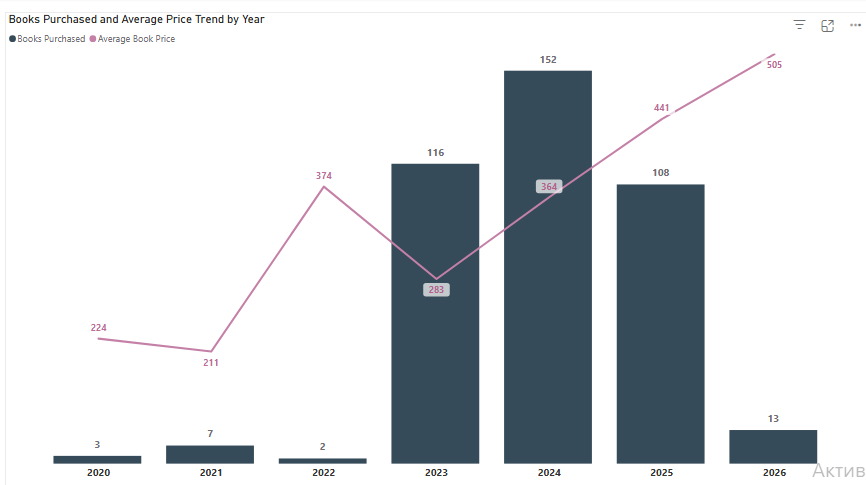
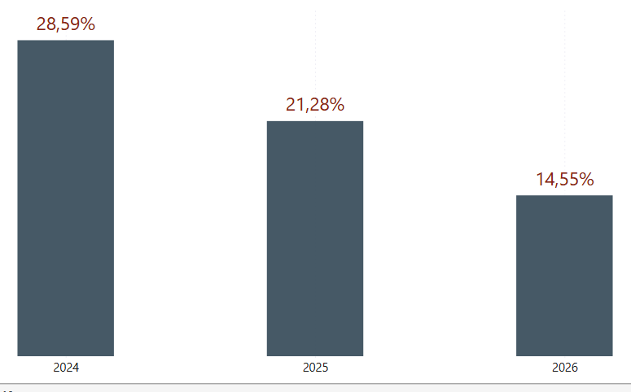
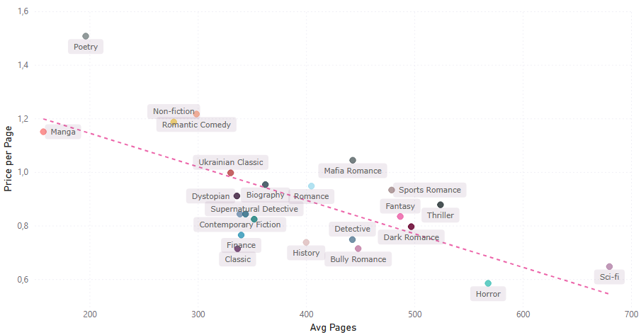
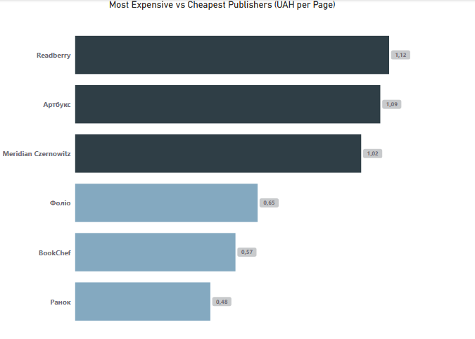
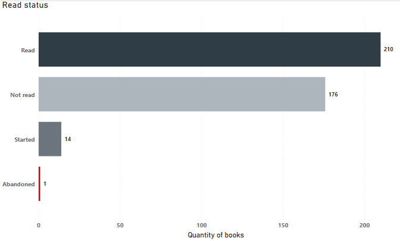
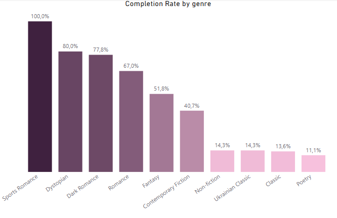

# Personal Library SQL Analysis

Dataset: personal book library (401 books)  
Database: PostgreSQL  
Purpose: exploratory analysis of book purchases, pricing, and reading habits  

---

## 1 Average book price by year

```sql
SELECT 
    EXTRACT(YEAR FROM purchase_date) AS year,
    COUNT(*) AS total_books,
    ROUND(AVG(price), 2) AS avg_price
FROM library
WHERE price IS NOT NULL
GROUP BY EXTRACT(YEAR FROM purchase_date)
ORDER BY year;
```

**Result:**

| year | total_books | avg_price |
|---|---:|---:|
| 2020 | 3 | 223.67 |
| 2021 | 7 | 210.86 |
| 2022 | 2 | 374.00 |
| 2023 | 115 | 282.68 |
| 2024 | 152 | 363.50 |
| 2025 | 108 | 440.85 |
| 2026 | 13 | 505.00 |



**Insight:**

The chart shows a sharp spike in average book prices in 2022, which may be related to market disruptions following the start of the war in Ukraine.

In 2023, prices partially corrected and stabilized, suggesting a short-term adjustment after the initial shock.

In the following years, a steady upward trend is observed, likely driven by inflation and broader economic factors.

---

## 2 Year-over-year change in average book price

```sql
WITH yearly_stats AS (
    SELECT 
        EXTRACT(YEAR FROM purchase_date) AS year,
        COUNT(*) AS total_books,
        ROUND(AVG(price), 2) AS avg_price
    FROM library
    WHERE price IS NOT NULL
    GROUP BY EXTRACT(YEAR FROM purchase_date)
    HAVING COUNT(*) > 10
)
SELECT
    year,
    total_books,
    avg_price,
    ROUND(
        (avg_price - LAG(avg_price) OVER (ORDER BY year))
        * 100.0
        / LAG(avg_price) OVER (ORDER BY year),
        2
    ) AS pct_change
FROM yearly_stats
ORDER BY year;
```

**Result:**

| year | total_books | avg_price | pct_change |
|---|---:|---:|---:|
| 2023 | 115 | 282.68 | NULL |
| 2024 | 152 | 363.50 | 28.59 |
| 2025 | 108 | 440.85 | 21.28 |
| 2026 | 13 | 505.00 | 14.55 |




**Insight:**

The analysis shows a steady year-over-year increase in average book prices.

At the same time, the rate of growth is gradually slowing down, which may indicate that the market has passed its most turbulent phase and is moving toward stabilization.

Barring any new major disruptions, price increases will likely be more in line with general inflation trends.

---

## 3 Most expensive books by price per page

```sql
SELECT 
    title,
    author,
    price,
    pages,
    ROUND(price / pages, 3) AS price_per_page
FROM library
WHERE price IS NOT NULL
  AND pages > 0
ORDER BY price_per_page DESC
LIMIT 10;
```

**Result:**

| title | author | price | pages | price_per_page |
|---|---|---:|---:|---:|
| Тіні забутих предків | Михайло Коцюбинський | 395 | 136 | 2.904 |
| 30 віршів про любов і залізницю | Сергій Жадан | 228 | 88 | 2.591 |
| Тільки не пиши мені про війну | Павло Вишебаба | 295 | 120 | 2.458 |
| Список кораблів | Сергій Жадан | 360 | 160 | 2.250 |
| Племʼя | Себастьян Юнґер | 270 | 128 | 2.109 |
| Таємниці маєтку шипів | Марґарет Роджерсон | 300 | 144 | 2.083 |
| Конклав | Пенелопа Дуглас | 225 | 112 | 2.009 |
| Радуйся жінко | Мар'яна Савка | 180 | 96 | 1.875 |
| Тамплієри | Сергій Жадан | 225 | 120 | 1.875 |
| Знайди мене | Тагере Мафі | 300 | 160 | 1.875 |

**Insight:**

The results do not reveal a clear pattern related to specific authors or publishers driving higher prices.

Instead, the main factor appears to be book length — shorter books tend to have a higher price per page.

---

## 4 Average price per page by genre

```sql
SELECT 
    genre,
    COUNT(*) AS total_books,
    ROUND(AVG(pages), 0) AS avg_pages,
    ROUND(AVG(price / pages), 3) AS avg_price_per_page
FROM library
WHERE price IS NOT NULL
  AND pages > 0
GROUP BY genre
ORDER BY avg_price_per_page DESC
LIMIT 10;
```

**Result:**

| genre | total_books | avg_pages | avg_price_per_page |
|---|---:|---:|---:|
| Поезія | 9 | 196 | 1.760 |
| Нон-фікшн | 7 | 278 | 1.210 |
| Українська класика | 7 | 330 | 1.200 |
| Ромком | 3 | 299 | 1.198 |
| Манга | 3 | 157 | 1.164 |
| Мафія | 2 | 443 | 1.044 |
| Біографічна проза | 3 | 362 | 1.006 |
| Даркроман | 8 | 497 | 0.974 |
| Любовний роман | 94 | 405 | 0.972 |
| Спортивний роман | 24 | 479 | 0.962 |



**Insight:**

Price per page varies significantly across genres, with poetry and manga showing the highest values.

These genres typically have shorter average length, which contributes to a higher cost per page, while longer genres such as romance or sports fiction provide better value.

This highlights that genre plays an important role in pricing structure, not just book length alone.

---

## 5 Most expensive vs cheapest publishers

```sql
(SELECT 
    'Most expensive' AS category,
    publisher,
    COUNT(*) AS total_books,
    ROUND(AVG(pages), 0) AS avg_pages,
    ROUND(AVG(price / pages), 3) AS avg_price_per_page
FROM library
WHERE price IS NOT NULL
  AND pages > 0
GROUP BY publisher
HAVING COUNT(*) >= 5
ORDER BY avg_price_per_page DESC
LIMIT 3)

UNION ALL

(SELECT 
    'Cheapest' AS category,
    publisher,
    COUNT(*) AS total_books,
    ROUND(AVG(pages), 0) AS avg_pages,
    ROUND(AVG(price / pages), 3) AS avg_price_per_page
FROM library
WHERE price IS NOT NULL
  AND pages > 0
GROUP BY publisher
HAVING COUNT(*) >= 5
ORDER BY avg_price_per_page
LIMIT 3);
```

**Result:**

| category | publisher | total_books | avg_pages | avg_price_per_page |
|---|---|---:|---:|---:|
| Most expensive | Meridian Czernowitz | 7 | 288 | 1.409 |
| Most expensive | Артбукс | 6 | 413 | 1.139 |
| Most expensive | Readberry | 27 | 433 | 1.128 |
| Cheapest | Ранок | 9 | 524 | 0.586 |
| Cheapest | BookChef | 24 | 509 | 0.595 |
| Cheapest | Фоліо | 11 | 296 | 0.652 |



**Insight:**

Price per page differs significantly between publishers.

---

## 6 Reading completion status

```sql
SELECT 
    status,
    COUNT(*) AS total_books,
    ROUND(
        COUNT(*) * 100.0 / SUM(COUNT(*)) OVER (),
        2
    ) AS percentage
FROM library
GROUP BY status
ORDER BY total_books DESC;
```

**Result:**

| status | total_books | percentage |
|---|---:|---:|
| Прочитано | 210 | 52.37 |
| Не прочитано | 176 | 43.89 |
| Почато | 14 | 3.49 |
| Закинуто | 1 | 0.25 |



**Insight:**

More than half of books are completed.

---

## 7 Top 3 years by purchases

```sql
WITH cte AS (
    SELECT
        EXTRACT(YEAR FROM purchase_date) AS year,
        COUNT(*) AS total_books,
        RANK() OVER (ORDER BY COUNT(*) DESC) AS rank_by_books
    FROM library
    WHERE price IS NOT NULL
    GROUP BY EXTRACT(YEAR FROM purchase_date)
)
SELECT *
FROM cte
WHERE rank_by_books <= 3
ORDER BY rank_by_books;
```

**Result:**

| year | total_books | rank_by_books |
|---|---:|---:|
| 2024 | 152 | 1 |
| 2023 | 115 | 2 |
| 2025 | 108 | 3 |

**Insight:**

2024 is the peak year of purchases.

---

## 8 Completion rate by genre

```sql
SELECT
    genre,
    COUNT(*) AS total_books,
    SUM(CASE WHEN status = 'Прочитано' THEN 1 ELSE 0 END) AS completed_books,
    ROUND(
        SUM(CASE WHEN status = 'Прочитано' THEN 1 ELSE 0 END) * 100.0 / COUNT(*),
        2
    ) AS completion_rate
FROM library
WHERE genre IS NOT NULL
GROUP BY genre
HAVING COUNT(*) >= 5
ORDER BY completion_rate DESC;
```

**Result:**

| genre | total_books | completed_books | completion_rate |
|---|---:|---:|---:|
| Спортивний роман | 24 | 24 | 100.00 |
| Антиутопія | 5 | 4 | 80.00 |
| Даркроман | 9 | 7 | 77.78 |
| Любовний роман | 94 | 63 | 67.02 |
| Фентезі | 139 | 72 | 51.80 |
| Сучасна проза | 59 | 24 | 40.68 |
| Українська класика | 7 | 1 | 14.29 |
| Нон-фікшн | 7 | 1 | 14.29 |
| Класика | 17 | 2 | 11.76 |
| Поезія | 9 | 1 | 11.11 |



**Insight:**

Completion rates differ significantly by genre.

---

## Final Summary

- Book prices increased over time  
- Shorter books are more expensive per page  
- Price varies across publishers  
- Reading behavior differs by genre  
- A significant share of books remains unread  
