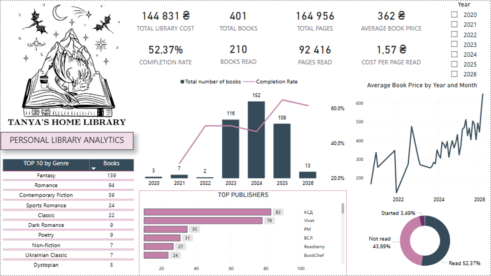

# Personal Library Analytics

## Project Overview
This project analyzes a personal home library using multiple data analysis tools.  
The goal is to explore reading habits, understand how the library grows over time, and analyze spending patterns on books.

The analysis combines SQL, Google Sheets, and Power BI to transform raw library data into insights and visualizations.

---

# Research Objective

The main objectives of this analysis are:

- Analyze personal reading habits
- Track the growth of the home library over time
- Measure reading progress and completion rate
- Identify the most common genres and publishers
- Analyze spending patterns on books
- Explore relationships between book price, pages, and reading activity

---

# Tools Used

### SQL
Used for data exploration and analytical queries to extract insights from the dataset.

### Google Sheets
Used for data cleaning and basic exploration.


### Power BI
Used to build an interactive dashboard that visualizes the key metrics and insights.

---

# Project Structure

```
personal-library-dashboard
│
├── powerbi
│   └── personal-library-powerbi-dashboard.png
│
├── sheets
│   └── personal-library-dashboard-google-sheets.png
│
├── sql
│   └── library-analysis.sql
│
└── README.md
```

---

# Power BI Dashboard

The Power BI dashboard visualizes key insights from the dataset.

### Key Metrics

- Total Library Cost
- Total Books
- Total Pages
- Books Read
- Completion Rate
- Average Book Price
- Cost per Page Read

### Analytical Insights

- Books acquired by year
- Reading completion trend
- Genre distribution
- Top publishers
- Reading status distribution
- Average book price trend

### Dashboard Preview



---

# SQL Analysis Examples

Some insights were explored using SQL queries.

### Example 1 — Top Genres in the Library

```sql
SELECT genre,
       COUNT(*) AS books
FROM library
GROUP BY genre
ORDER BY books DESC
LIMIT 10;
```

### Example 2 — Top Publishers

```sql
SELECT publisher,
       COUNT(*) AS books
FROM library
GROUP BY publisher
ORDER BY books DESC
LIMIT 5;
```

These queries help identify the most represented genres and publishers in the personal library.

---

# Data Description

The dataset contains information about books in a personal library, including:

- book title
- author
- publisher
- genre
- number of pages
- pages read
- purchase date
- reading status
- book price

The dataset is personal and therefore not publicly shared in this repository.

---

# Conclusion

This analysis provides insights into personal reading behavior and book collection patterns.

The dashboard shows how the library has grown over time, highlights dominant genres and publishers, and tracks reading progress through completion rate and pages read.

Combining SQL, Google Sheets, and Power BI allows the dataset to be explored from multiple analytical perspectives and transformed into clear and interactive visual insights.
