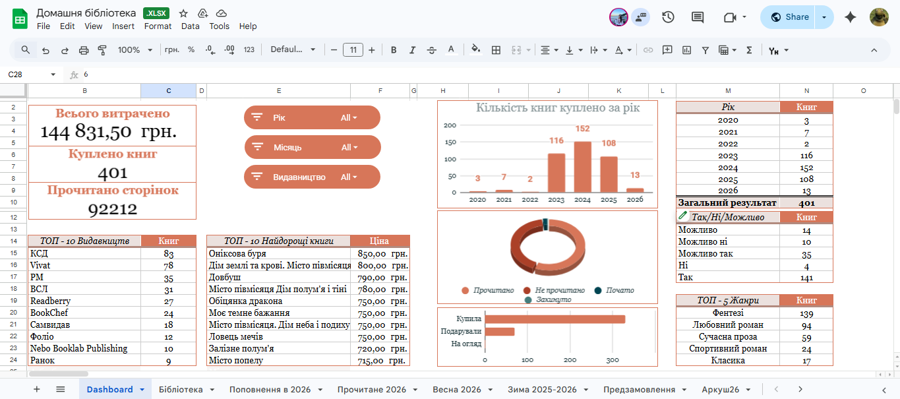
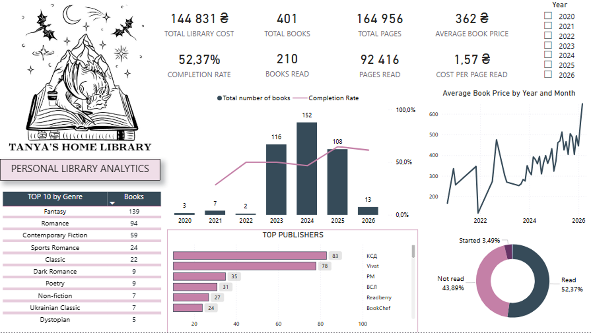

# Personal Library Analytics

## Project Overview
This project analyzes a personal home library using multiple data analysis tools.  
The goal is to explore reading habits, understand how the library grows over time, and analyze spending patterns on books.

The analysis combines SQL, Google Sheets, and Power BI to transform raw library data into insights and visualizations.

---

## Research Objective

The main objectives of this analysis are:

- Analyze personal reading habits
- Track the growth of the home library over time
- Measure reading progress and completion rate
- Identify the most common genres and publishers
- Analyze spending patterns on books
- Explore relationships between book price, pages, and reading activity

---

## Project Structure

```
personal-library-dashboard
│
├── 01_sheets
│   └── personal-library-dashboard-google-sheets.png
│
├── 02_sql
│   └── library-analysis.sql
│
├── 03_powerbi
│   └── personal-library-powerbi-dashboard.png
│
└── README.md
```

---

## Tools Used

### Google Sheets
Used for data cleaning and basic exploration.

### SQL
Used for data exploration and analytical queries to extract insights from the dataset.

### Power BI
Used to build an interactive dashboard that visualizes the key metrics and insights.

---

## Google Sheets Dashboard

The Google Sheets dashboard was used for data cleaning, initial exploration, and basic analysis of the dataset.

### Dashboard Preview



---

## SQL Analysis Examples

Some insights were explored using SQL queries.

### Example 1 — Library Growth and Average Book Price by Year

```sql
SELECT 
    EXTRACT(YEAR FROM purchase_date) AS year,
    COUNT(*) AS total_books,
    ROUND(AVG(price), 2) AS avg_price
FROM library
WHERE price IS NOT NULL
GROUP BY EXTRACT(YEAR FROM purchase_date)
ORDER BY year;
```

-- Result:

```text
year | total_books | avg_price
2020 | 3           | 223.67
2021 | 7           | 210.86
2022 | 2           | 374.00
2023 | 115         | 282.68
2024 | 152         | 363.50
2025 | 108         | 440.85
2026 | 13          | 505.00
```

### Example 2 — Most Expensive and Cheapest Publishers (Price per Page)

```sql
(SELECT 
    'Most expensive' AS category,
    publisher,
    COUNT(*) AS total_books,
    ROUND(AVG(pages), 0) AS avg_pages,
    ROUND(AVG(price / pages), 3) AS avg_price_per_page
FROM library
WHERE price IS NOT NULL
  AND pages > 0
GROUP BY publisher
HAVING COUNT(*) >= 5
ORDER BY avg_price_per_page DESC
LIMIT 3)

UNION ALL

(SELECT 
    'Cheapest' AS category,
    publisher,
    COUNT(*) AS total_books,
    ROUND(AVG(pages), 0) AS avg_pages,
    ROUND(AVG(price / pages), 3) AS avg_price_per_page
FROM library
WHERE price IS NOT NULL
  AND pages > 0
GROUP BY publisher
HAVING COUNT(*) >= 5
ORDER BY avg_price_per_page
LIMIT 3);
```

-- Result:

```text
category        | publisher             | total_books | avg_pages | avg_price_per_page
Most expensive  | Meridian Czernowitz   | 7           | 288       | 1.409
Most expensive  | Артбукс               | 6           | 413       | 1.139
Most expensive  | Readberry             | 27          | 433       | 1.128
Cheapest        | Ранок                 | 9           | 524       | 0.586
Cheapest        | BookChef              | 24          | 509       | 0.595
Cheapest        | Фоліо                 | 11          | 296       | 0.652
```

These queries help identify trends in book acquisition and compare publishers based on the average price per page.

---

## Power BI Dashboard

The Power BI dashboard visualizes key insights from the dataset.

### Key Metrics

- Total Library Cost
- Total Books
- Total Pages
- Books Read
- Completion Rate
- Average Book Price
- Cost per Page Read

### Analytical Insights

- Books acquired by year
- Reading completion trend
- Genre distribution
- Top publishers
- Reading status distribution
- Average book price trend

### Dashboard Preview



---

## Data Description

The dataset contains information about books in a personal library, including:

- book title
- author
- publisher
- genre
- number of pages
- pages read
- purchase date
- reading status
- book price

The dataset is personal and therefore not publicly shared in this repository.

---

## Conclusion

This analysis provides insights into personal reading behavior and book collection patterns.

The dashboard shows how the library has grown over time, highlights dominant genres and publishers, and tracks reading progress through completion rate and pages read.

Combining SQL, Google Sheets, and Power BI allows the dataset to be explored from multiple analytical perspectives and transformed into clear and interactive visual insights.
